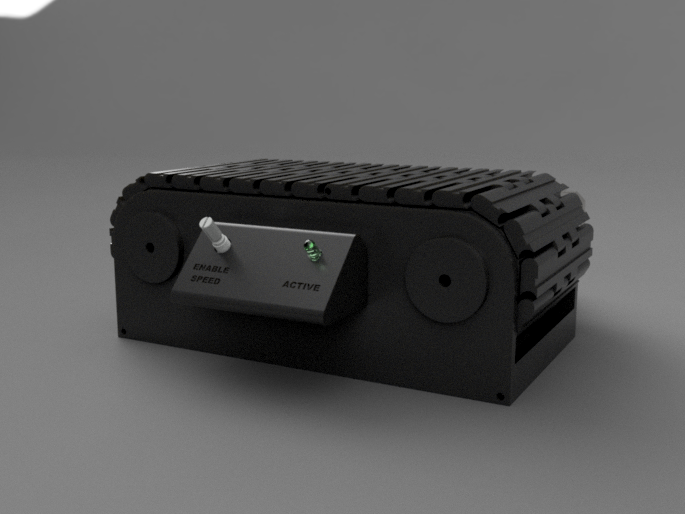

# Conveyor-Belt
This is a nearly fully 3D printed conveyor belt.
It requires 
- Nema 42mm stepper motor, 
- Stepper motor, an Arduino, 
- Potentiometer and 
- 5mm LED 
as electronics

All the printed parts required for this project is provided under the related folder.

Code of the project is also provided under the related section.

Here are some renders:

Here are some real pictures of the conveyor:

